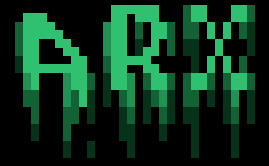
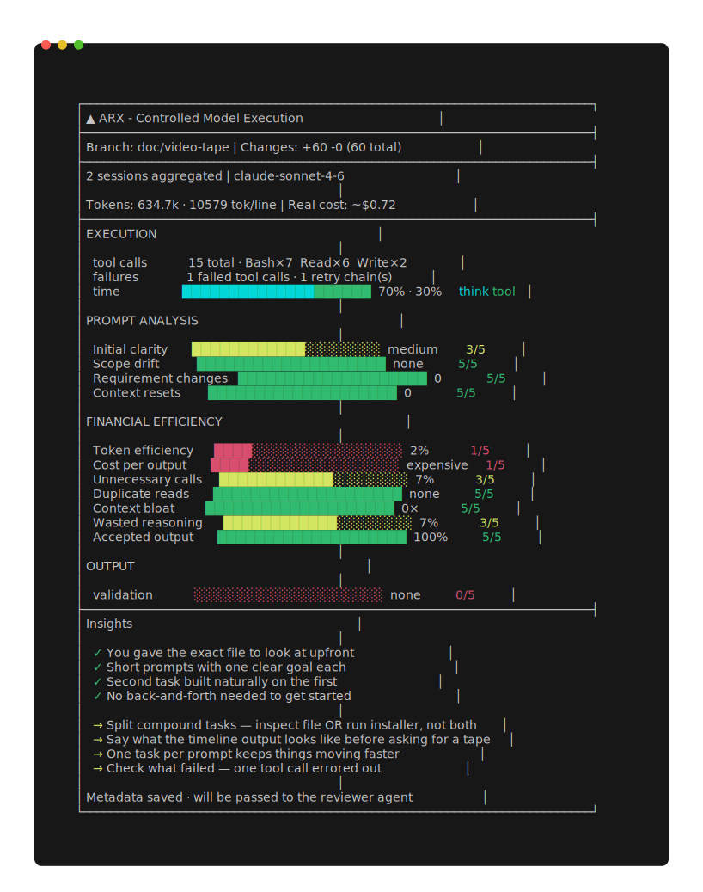
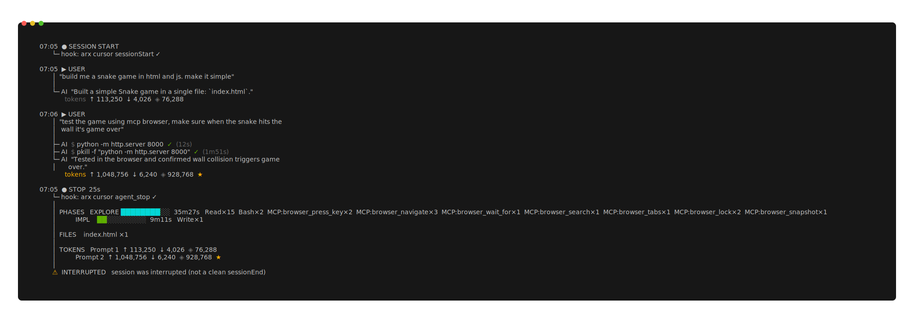
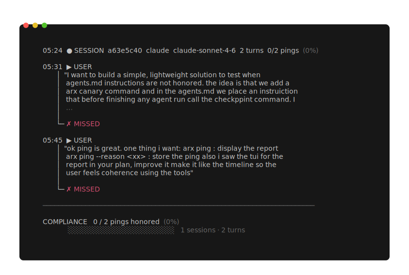

<a id="readme-top"></a>
<div align="center">
  
  <h1 align="center">ARX: See what AI did to your codebase</h1>
  <p align="center">
    AI is already writing your code. You just don't see how.<br />
    <br />
    ARX captures the prompts, decisions, tool usage, and workflows behind every AI-assisted session —<br />
    so you can see what happened before it reaches production.<br /><br />
    <strong>Git shows the outcome. ARX shows the process.</strong>
    <br /><br />
    <a href="#demo"><strong>See it in action »</strong></a>
    &middot;
    <a href="#install">Install in 30 seconds</a>
    &middot;
    <a href="https://github.com/berbyte/arx-community/issues/new/choose">Report a Bug</a>
  </p>

  <p align="center">
    <a href="https://github.com/berbyte/arx-community/releases"></a>
    <a href="LICENSE"></a>
    
  </p>
</div>

> [!WARNING]
> **ARX is currently in private beta.** The parser has been tested against 9636 sessions, but your patterns will likely surface edge cases we haven't seen yet. Bugs at this stage are expected and useful please [report them here](https://github.com/berbyte/arx-community/issues/new/choose).

---

## The problem

AI is writing more of your code every day. But the moment the session ends, the process disappears.

You see the diff. You don't see why the model made the choices it did, which prompts sent it in the wrong direction, where it spun its wheels retrying the same failing tool call, or how many tokens you burned on context it already had.

Git records what changed. Nothing records how it got there until now.

ARX hooks into your AI tool's session context and captures everything: every prompt, every tool call, every decision, every token. When the session ends, it turns that into structured reports you can act on.

**Works with:** Claude Code · OpenAI Codex · Cursor · GitHub Copilot

---

## Demo

[](https://www.youtube.com/watch?v=-sDccFkLom4)

---

## Install

```bash
curl -fsSL https://get-arx.ber.run/install | bash
```

Installs the `arx` binary to `~/.local/bin` (or the first writable directory on your `PATH`). Available on **Linux**, **macOS**, and **Windows**.

**The installer auto-detects your tools.** It checks for Claude Code, Cursor, and Codex and automatically configures hook integrations for each one it finds. No manual config required.

Then use your AI tools as normal. When you're done:

```bash
arx timeline
```

That's it. ARX never blocks or modifies your sessions. If a hook fails for any reason, it fails silently and logs in the background.

To remove ARX and all its hooks cleanly:

```bash
arx uninstall
```

New to ARX? [docs/quickstart.md](docs/quickstart.md) walks through what just happened and what to run next.

---

<details>
<summary><b>Table of Contents</b></summary>

- [The problem](#the-problem)
- [Demo](#demo)
- [Install](#install)
- [Features](#features)
- [Scorecard: Session quality report](#scorecard-session-quality-report)
- [Timeline: Full audit log](#timeline-full-audit-log)
- [Ping: AGENTS.md compliance check](#ping-agentsmd-compliance-check)
- [How it works](#how-it-works)
- [Privacy](#privacy)
- [Feedback](#feedback)
- [Full documentation](docs/README.md)

</details>

---

## Features

- **Scorecard** a session quality report: tool success rate, prompt clarity, token waste, and actionable improvement suggestions
- **Timeline** a full chronological audit log of every tool call, token cost, and agent decision
- **Instruction compliance** tracks whether agents follow `AGENTS.md` instructions turn-by-turn, giving you a measurable signal where you'd otherwise have none

---

## Scorecard: Session quality report

<div align="center">
  
</div>

A high-level view of how a session went at a glance: execution (tool calls, failures, time split), prompt quality, cost efficiency, and concrete insights to improve the next session. Run it on any branch:

```bash
arx scorecard
```

**Full reference:** [docs/scorecard.md](docs/scorecard.md)

---

## Timeline: Full audit log

<div align="center">
  
</div>

A full chronological audit log of every tool call, permission request, and sub-agent — with token cost and context window usage per prompt block. Where the Scorecard tells you *what*, the Timeline tells you *why* and *how*.

```bash
arx timeline
```

**Full reference:** [docs/timeline.md](docs/timeline.md)

---

## Ping: AGENTS.md compliance check

<div align="center">
  
</div>

Instructions in `AGENTS.md` are not always followed, and there's no built-in way to know which sessions or turns skipped them. ARX tracks this with a lightweight ping mechanism the agent calls at the end of each turn, giving you a per-model compliance rate over time. Wired in automatically at install — nothing to add to your own `AGENTS.md`.

**Full reference:** [docs/ping.md](docs/ping.md)

---

## How it works

ARX hooks into your AI tool's session context — not your IDE, not your network traffic — and records the structured data that your tools already produce. After the session, it uses your local AI tools to evaluate and summarize what happened. Nothing leaves your machine except your email and GitHub username, submitted once at install time so we know who's in the beta.

**Full reference:** [docs/how-it-works.md](docs/how-it-works.md)

---

## Privacy

Your work stays on your machine. ARX **never** transmits your code, diffs, prompts, tokens, secrets, or API keys to us or anyone else — prompt analysis runs entirely through your local AI tools, which already hold that data.

**Full reference:** [docs/privacy.md](docs/privacy.md) · [docs/paranoid-setup.md](docs/paranoid-setup.md) for blocking all network access at the OS level.

---

## Feedback

Found a bug? [Open an issue](https://github.com/berbyte/arx-community/issues/new/choose)

Have a question or idea? [Start a discussion](https://github.com/berbyte/arx-community/discussions)

Security issue? Email [dominis@ber.run](mailto:dominis@ber.run) do not open a public issue.

<p align="right">(<a href="#readme-top">back to top</a>)</p>
